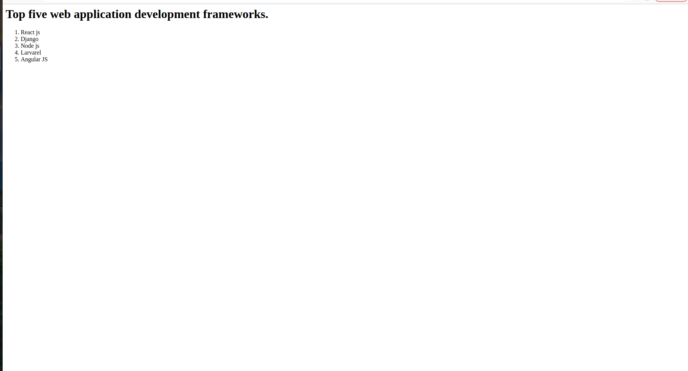

# Developing a Simple Webserver

# AIM:
name:s vikash
reference no:22008879


# DESIGN STEPS:

## Step 1:

HTML content creation is done

## Step 2:

Design of webserver workflow

## Step 3:

Implementation using Python code

## Step 4:

Serving the HTML pages.

## Step 5:

Testing the webserver

# PROGRAM:
```
from http.server import HTTPServer,BaseHTTPRequestHandler

content="""
<html>
<head>
</head>
<body>
<h1>Top five web application development frameworks.</h1>
     <ol>
      <li>React js</li>
      <li>Django </li>
      <li>Node js </li>
      <li>Larvarel </li>
      <li>Angular JS </li>
      </ol>

</body>
</html>
"""

class HelloHandler(BaseHTTPRequestHandler):
    def do_GET(self):
        self.send_response(200)
        self.send_header('content-type','text/html; charset=uft-8')
        self.end_headers()
        self.wfile.write(content.encode())


server_address=('',80)
httpd = HTTPServer(server_address, HelloHandler)
httpd.serve_forever()

```

# OUTPUT:



# RESULT:

The program is executed succesfully
